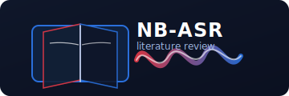

# NB-ASR Literature Review

  

A curated collection of reading lists focused on building Norwegian Automatic Speech Recognition (ASR) systems, with emphasis on post-Whisper architectures and data curation strategies.

## Reading Lists

### [Data Curation, Weak Supervision & Dataset Quality](datasetcuration.md)

A reading list covering large-scale data pipelines, weak/partial supervision techniques, and quality audits for ASR. Focuses on post-Whisper supervised or semi-supervised datasets. Includes papers on:

- Industrial-scale multilingual ASR data pipelines (Universal-1, Granary, MOSEL)
- Pseudo-labeling and cleaning strategies (OWSM v4, YODAS)
- Weak supervision techniques for imperfect transcripts (OTC, BTC)
- Data quality filtering and refinement methods

### [Model Architectures & Systems](architectures.md)

A reading list focused on post-Whisper architectures, with Parakeet-style models in mind. Covers:

- Foundation models (Whisper, MMS)
- Efficient architectures (Fast Conformer, Token-Duration Transducers)
- Production systems (Canary/Parakeet)
- Speech LLMs and evaluation frameworks

## Podcast Access

- RSS feed: https://raw.githubusercontent.com/NationalLibraryOfNorway/nb-asr-literature/main/podcast.xml  

### iPhone (Apple Podcasts)
1) Copy the RSS feed URL above.  
2) Open the Apple Podcasts app → Library → “Follow a Show by URL”.  
3) Paste the URL, tap **Follow**, then tap a single episode to stream or download for offline listening.

### Android (Pocket Casts or AntennaPod)
1) Install a podcast app that supports RSS import (Pocket Casts or AntennaPod).  
2) Choose **Add a podcast by URL** (Pocket Casts) or **Add podcast** → **Add via URL** (AntennaPod).  
3) Paste the RSS feed URL, follow/subscribe, and tap the download icon on any episode to save it offline.

### Direct download (any platform)
- Open the RSS feed and click an episode’s audio link, or browse the `audio/` folder in this repo.  
- Your browser or player will let you save the `.mp3` file for offline listening.

## Purpose

This repository serves as a living document for the NB-ASR team working on Norwegian ASR. Each entry includes:
- Why it matters for Norwegian ASR development
- What to focus on when reading
- Relevance to practical implementation decisions

## Credits & License

- Podcast episodes (audio summaries) are generated with NotebookLM from the curated reading lists in this repository.  
- Repository text and the podcast feed are © 2025 National Library of Norway; please attribute “Norwegian ASR Literature Review, National Library of Norway” when sharing.  
- Original research papers and abstracts remain under their respective authors’ copyrights and licenses; please refer to the linked sources for reuse terms.
